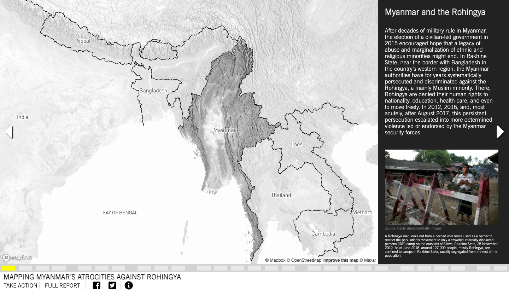

Tram-Anh Nguyen
GEOG 458
10/12/21

In this essay, I will be performing an analysis on a geo-narrative map about crimes against the Rohingya in Myanmar. The research and the map were conducted by Amnesty International and SITU Research. The link to this map can be found [here](https://mapping-crimes-against-rohingya.amnesty.org/#01_geo_01). The purpose of this project was to report the abhorrent crime against humanity that was occurring in Myanmar. The Rohingya are a minority ethnic group that resided in Myanmar. The project presents the Rohingya conflict in a linear, straightforward manner. While not all of the crimes were presented here, some of the biggest and well-documented events are shown to the audience. It begins with the series of attacks on the security forces by the Rohingya armed groups and how the military involvement escalated the tension even further. As the audience progress through the map via clickable arrows, we can see how the military initiated a full-blown ethnic cleansing on its own people. Very specific areas of towns where known population of Rohingya resided were burned to the ground. As the audience proceeds towards the end of the map, we see the results and consequences of the ethnic cleansing, such as land usage after the burning of towns and what happened to the Rohingya themselves.

Regarding the actual map of this project, the creator presented this conflict in a series of slides. It's very reminiscent of PowerPoint slides. What we can see are: a map in the middle, a black column on the right that gives context or an explanation to support the claim of the current topic's map (or there can be extra information, as well, like anecdotal experiences), clickable arrows to the left and right side for topic navigation. At the bottom, there's a progress bar that's filled up as the audience continues to make progress and consume information. The bar helps visualize the beginning, the middle, and the end of this narrative created by the authors. In some portion of this project, the audience has the chance to interact with the map, if there is a yellow icon present in the bottom right corner. If the user clicks on the interactive area, they can find out more information on the right column. The audience of this project is those who are familiar with or have heard of the issue occurring in Myanmar. Typically, the openings of such projects provide a detailed introduction of the issue. Information such as the population affected and the group that is causing the conflict should be provided. However, the first slides only give a very brief context on the situation, which is a sign that the intended audience are those who are already aware of what was happening in Myanmar but they want a more detailed and visualized report. As mentioned above, the author of this project is Amnesty International and SITU Research. Amnesty International is a human rights organization. They are often involved in international issues and campaigns against anything or anyone that threatens human rights such as dictatorship, political repression, authoritarianism, and more. They fund many journalists and independent investigations to collect as much accurate data as they can and synthesize it into large reports. They claim to be non-political, do not side with any religions, and do not have any economic interests. SITU Research is an organization that collaborates with various other organizations (such as Amnesty International), utilizing various tools, practices, and applications to bring humanistic issues to light. According to their website, their responsibilities include: Spatial Analysis, Platform Development, Master Planning, Fact Finding / Reporting, and Organizational Consulting. While there are no specific indications of where the data came from, the author did link to Amnesty International's full report “We Will Destroy Everything”: Military Responsibility for Crimes against Humanity in Rakhine State, Myanmar", which can be found [here](https://www.amnesty.org/en/documents/asa16/8630/2018/en/). We assume that information from the geo-narrative map was pulled from this report and is a presentation of a few of the many crimes that the Myanmar military committed. According to the report: "This report is based on more than 400 interviews carried out between September 2017 and June 2018". There is roughly about a year's worth of intensive investigation in this report and the map may be presenting only a very small portion of it.

As for the map design of this project, it's simple to navigate in and also easy to interact with. All of the map data were presented on a plain terrain map and is built upon it. When the creators present the burning of towns to the audience, you can see the thematic layers really shine through. On top of the plain terrain maps, the user can see satellite image comparisons of the town that was burnt down. The user can also click on a slider and slide back and forth to see maps from 2016 versus 2017. There are stationary arrows on the left and right sides that the user can click on the go back and forth between different topics. Or, if the user prefers, they can also hover over the squares in the bottom progress bar which will preview the section's topic and can be clicked on. The navigation is not completely restrictive so the audience can go back to whichever "slides" they wish. Specific sections have a yellow icon in the corner that indicates there are interactive elements in this map. However, this can be missable due to its size, placement, and lack of explanations. The user will only find information on this icon in the 'i' icon at the very bottom, next to the symbols of Facebook and Twitter. Not everyone will understand or obligated to explore all the features of this project, therefore there's a chance that the user may not even know that the map is interactive. Another aspect of this project that I appreciated was the diversity of data presented on the map. I fully expected all of the slides to be only just thematic maps and reading some statements on the side. However, the creators implemented more than that. There were drone videos of the Rohingya refugees fleeing to Bangladesh, videos shot by journalists/investigators or local townspeople, and dynamic, visualized data on the side. The project utilizes many types of evidence and does not rely on just maps and graphs. The final element of this project that I thought was critical was how the creators ended the presentation: a call to action. In the last sections, we can see the creators denounce the political figures responsible for the crimes against the Rohingya and encouraged the audience to speak out and condemn Myanmar's actions. In this very last section, the user can sign a petition to bring attention to this conflict. At the very bottom of the page, the user can click on the Facebook or Twitter icon to post out awareness messages on their own profiles. It's an effective way to encourage the audience to be involved--little commitment and only a few clicks needed.

This project is reminiscent of one of week 7's readings: *Effective Geovisualizations* by Stuart Atkins and James Craine. Atkins and Craine discussed in detail how many geovisualizations are products of a "highly computer-literate mind" and there are very few humanistic and emotional elements in mapping. They claimed that humans and human culture are "a much more powerful producer of emotional geographies than static or animated cartographies, no matter how the data are visualised". The geo-narrative by Amnesty International is a great example of how maps are more than just data-delivering tools, but also a method to garner sympathy and attention towards a certain issue. Humans are more likely to attach themselves to something that they can relate to or sympathize with, which are emotions and the lives of others. The project attempts to balance between delivering facts and simultaneously convincing the audience that this is a conflict that they can speak out against on. By talking about how this issue is affecting real, innocent *people*, Amnesty International has created a map that goes beyond the presentation of data. Not only is this project demonstrating the devastating actions the Myanmar government was acting upon the Rohingya but also is an act of resistance. All maps are subjective and have some sort of message or point embedded by the author. By documenting the heinous ethnic cleansing by the Myanmar government, the creators are actively speaking out against them. This project by Amnesty International is a great example that maps can be a great tool of resistance and more than just a plain map on a screen. Maps are stories and it can act as the voice for those who are not in a position to speak up and defend themselves. However, that itself can be a major con for many. Many believe that all maps should be as objective as it possibly can with minimal bias from its creator. Yet, with human suffering on the line, it is difficult to present such an issue and forcing the authors to detach from their own morals and beliefs. As long as the map presents the data accurately and the creators are transparent about their data source and the purpose of their map, it is not ideal to dismiss geo-narratives.
